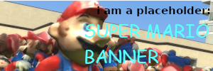

some type of imageboard using python/flask, and sqlite
VERY WIP DO NOT USE

[todo list](https://github.com/users/stophman1/projects/1)

markdown things:
- discord style newlines, its just better esp for this kinda thing
- no embedding images sorry you got the file uploader for that
- fancy links will DEFINITELY be toggleable for sure just imagine the abuse cases

image filename scheme:
(post id)_(image number (0-2)).whatever
validated by extension and then mime type
original filename ran through secure_filename before being put in db

r9k notes:
- check content against content fields
- start hashing images (im pretty sure 4chan r9k checks images too) and check against those hashes (new column in db?)
